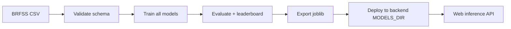

# MLOps Pipeline (AC-074)

Based on thesis §4.9 proposed end-to-end pipeline.

## Stages



## Commands

```bash
cd ai-cardiologist-ml
pip install -r requirements.txt
PYTHONPATH=src python scripts/train.py train --out models
pytest
```

## Artifacts

| File | Purpose |
|------|---------|
| `models/metrics.json` | Leaderboard |
| `models/artifacts/*.joblib` | Serialized pipelines |
| `models/artifacts/registry.json` | Model index |
| `models/global_importance.json` | ELI5 global weights |

## CI (AC-081)

Recommended GitHub Action:

- Trigger: `workflow_dispatch` or push to `models/**`
- Steps: install deps → train on synthetic/ cached CSV → fail if AUROC drops >2%
- Upload artifacts to release

## Environment variables

| Var | Service | Description |
|-----|---------|-------------|
| `MODELS_DIR` | backend | Path to joblib artifacts |
| `JWT_SECRET` | backend | Session signing key |
| `AI_CARDIO_DB` | backend | SQLite path |
| `VITE_API_BASE_URL` | web | API origin |
